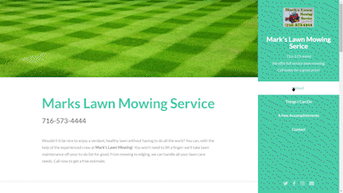
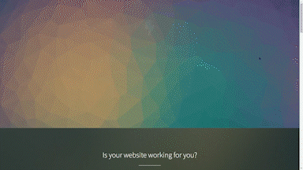

<!--  -->

### About Me

I am a full-stack software engineer who deveoped a passion for helping people while working as a chemical dependency counselor. I have experience building applications and websites from scratch for clients, being a part of large and small teams, and kicking some serious butt. 

### Technologies

## Projects
<table bordercolor="#66b2b2">
<tr>
    <td width="50%" valign="top">
      <h3 align="center">Mark's Lawn Service</h3>
         
        
         
        

          
  
  <!--  -->
      

        
<strong>

    </td>
    <td width="50%" valign="top">
      <h3 align="center">Portfolio</h3>
         
      
         
        

          
  
  <!--  -->
      

        
<strong></strong>  

    </td>
  </tr>
   <tr>
    <td width="40%" valign="top">
      <h3 align="center">DevDays</h3>
       
        
       
        

  
   <tr>
    <td width="40%" valign="top">
      <h3 align="center">DoYou</h3>
       
        
       
        

  
  <!--  -->
      

        
<strong>

    </td>
    <!-- <td width="50%" valign="top">
      <h3 align="center">NASA Picture of the Day</h3>
         
        
         
        
 -->
          
  <!-- 
  
      

        
<strong>

    </td>
  </tr> --> 
</table>

### How To Reach Me
 

<!---
Johnaius/Johnaius is a ✨ special ✨ repository because its `README.md` (this file) appears on your GitHub profile.
You can click the Preview link to take a look at your changes.
---
