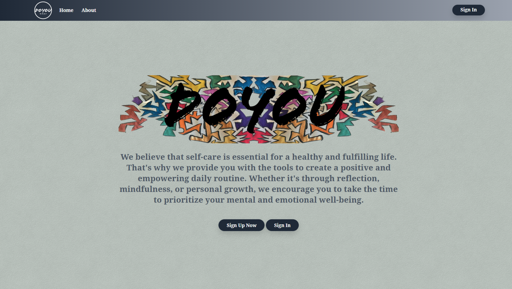
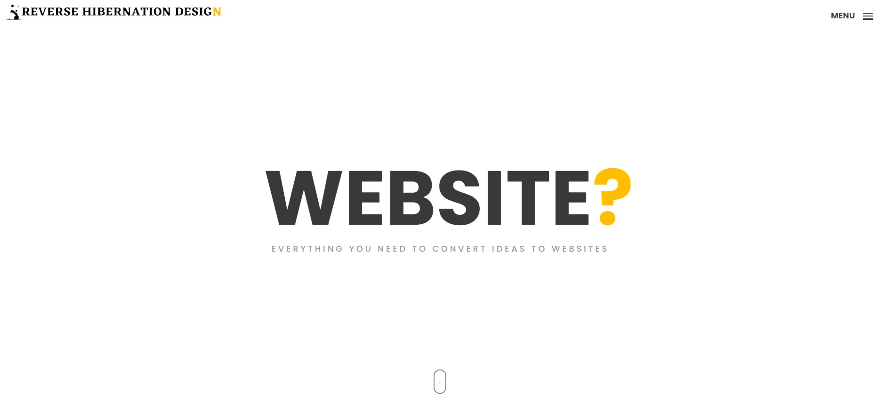
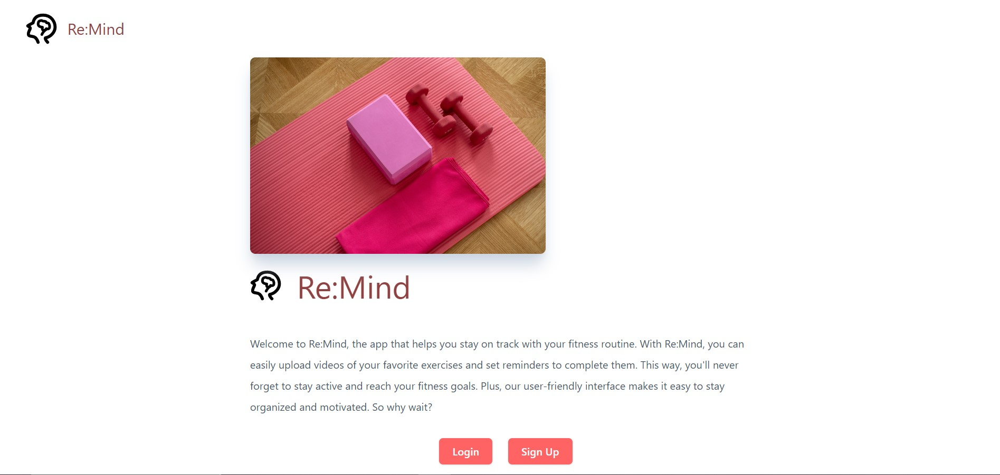
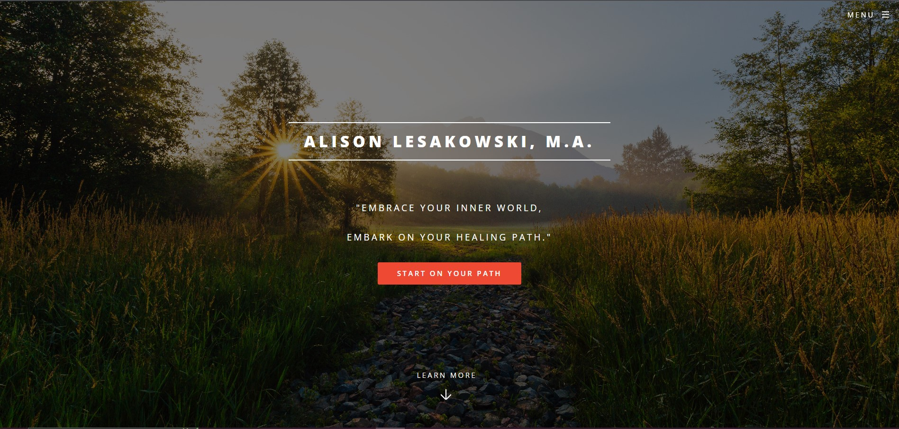

<!--  -->

### About Me

I am a full-stack software engineer who deveoped a passion for helping people while working as a chemical dependency counselor. I have experience building applications and websites from scratch for clients, being a part of large and small teams, and kicking some serious butt. 

### Technologies

  

## Projects

  <table>
      <tr>
      <td width="50%">
          <h3 align="center">DoYou</h3>
          

            
             <a href="https://github.com/Johnaius/doYou" target="_blank" rel="noreferrer"> </a> 
            

              Inspired by working with people in recovery to combat the "I suck" and "I can't" attidudes.
            

          

        </td>
           <td width="50%">
          <h3 align="center">Portfolio</h3>
          

            
               
            

            

          

        </td>
        <td width="49%">
          <h3 align="center">Re:Mind</h3>
          

            
             <a href="https://remind-workout.cyclic.app/" target="_blank" rel="noreferrer"> </a>  
            

            Community taught and Teambuilt with MVC arciteture using Node.js, Express.js, MongoDB and EJS. The idea of this app was to help a client stay on track with their physical therapy regimine.
            

          

        </td>
        <td width="50%">
          <h3 align="center">Freelance</h3>
          

            
              
            
Static website built for a therapist.  I learned alot about the importance of customer service and communication with clietns.
            

          

        </td>
        </tr>
  </table>

<table bordercolor="#66b2b2">

   
<!--  -->

### How To Reach Me
 

<!---
Johnaius/Johnaius is a ✨ special ✨ repository because its `README.md` (this file) appears on your GitHub profile.
You can click the Preview link to take a look at your changes.
---
